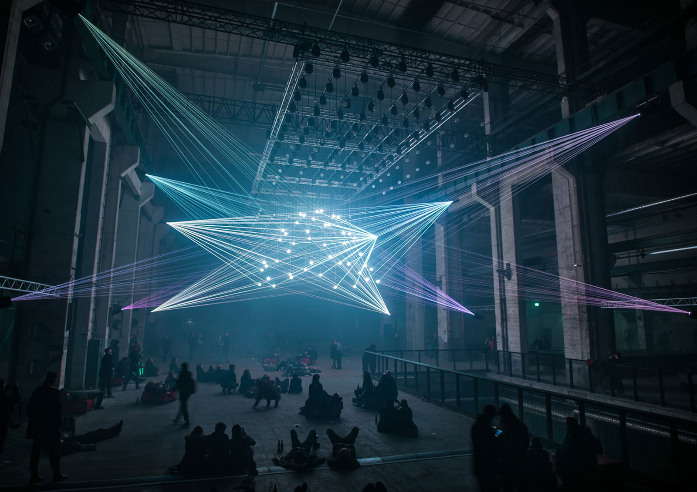
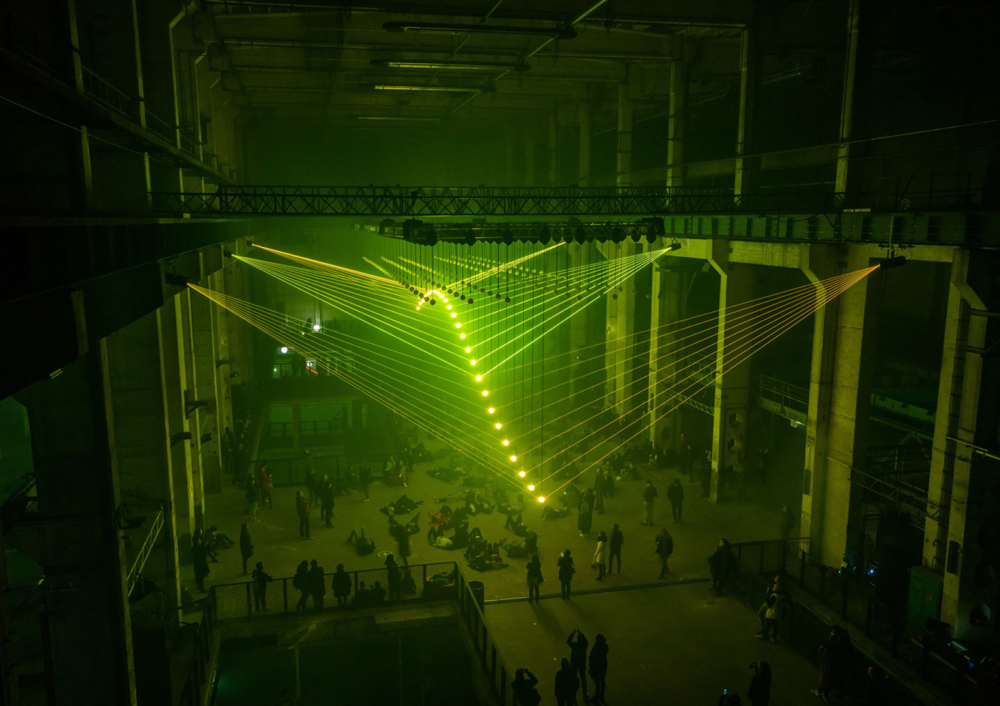

# Orientation Project: Audiovisual installation in VR  

Zainab Tariq

MA Creative Technologies 

Film University Babelsberg *KONRAD WOLF*

Winter Term 19/20

---
## Description

The main concept of this project is to create a first-person Virtual Reality application, where the user can experience an immersive and interactive audiovisual installation. He/she finds himself/herself in a dimly lit room containing multiple light/laser rays creating multidimensional light drawings. These drawings can be seen as vector drawings. The lights move in accordance to sounds that the user can hear. The light rays are animated and react to the user, for instance when the user changes his/her position or moves within a specified space. Moreover, the user is able to manipulate the lights by interacting with different objects. 

This project is inspired by visual artists such as Christopher Bauder and Shohei Fujimoto. The Audio-visual installations created by these artists are large scale installations, which take a lot of space and resources. The goal of this project is not only to provide the user with an artistic experience but also to make this type of installations accessible to a larger audience. Furthermore, the installation in VR gives the user a unique experience which is not possible in real life. This is achieved by breaking some laws of gravity and adding surreal elements to the environment. The enhance the immersiveness of the experience the users attention is caught by ambient lighting and music.

---
## Reference images

DeepWeb by Christopher Bauder and Robert Henke

---
## Scenarios

## Wost Case

* The user can experience an audiovisual installation
* The user can move in a room and can see a light show 
* There are sphere extended between the laser lights and the lights shine on spheres making varying shapes 
* Implementation of fog into the light show 
* Animation of light sources
* Implementation of audio which is created for the installation
* Lights move in sync with the audio
* The user can manipulate the lights by interacting with different sphere like objects within the environment 
* The spheres are animated and can detach themselves and move around in space

## Best Case

* The light movement/animation change according to the position of the user
* The user can interact with the spheres moving around the user
* There is audio attached to single objects e.g spheres and upon interaction with these objects different sounds are played
* The scale of the installation can be changed
* Ambient light and music to make the experience immersive
* Tutorial to show the interaction possibilities  
  
---

## Timetable

__November__
* finalize the concept
* set up Unity project 
* laser lights shader/material in Unity 
* 3D modeling

__December__
* sound design
* animation of lights

__January__
* texturing of the environment
* implement interactions in Unity 

__February__
* adding effects, e.g fog
* ambient lighting
* sphere animation
* testing

__March__
* extra interactions (according to the position of the user)
* attach sound to objects + functionality
* change scale 
* ambient music 
* instructions at the beginning of the experience
